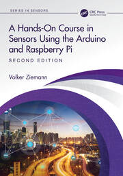

# HandsOnSensors2ed
Software for the [forthcoming second edition](https://www.routledge.com/A-Hands-On-Course-in-Sensors-Using-the-Arduino-and-Raspberry-Pi/Ziemann/p/book/9781032376196) of "A Hands-on Course in Sensors Using the Arduino and Raspberry Pi."

Here is the [link to the first edition](https://www.routledge.com/A-Hands-On-Course-in-Sensors-Using-the-Arduino-and-Raspberry-Pi/Ziemann/p/book/9780815393603). The code for it can be downloaded from that page.
